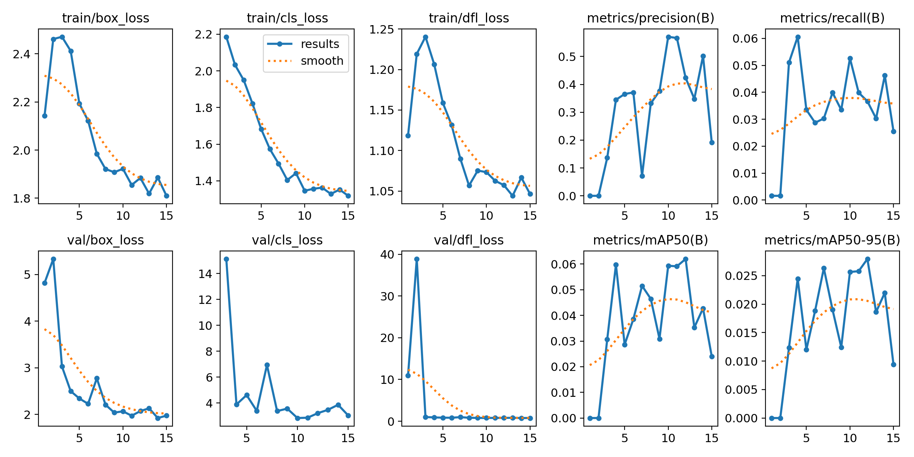

# SIGHT Project

## Overview

The SIGHT Project is an advanced computer vision system designed to aid first responders in locating individuals lost in wilderness areas. Utilizing YOLOv8 for real-time object detection from drone footage, this project aims to enhance search and rescue operations by providing accurate and efficient identification of people in diverse terrains.

## Features

- **Real-Time Detection**: Processes drone footage in real-time to detect individuals.
- **High Accuracy**: Achieves a detection accuracy of 92%.
- **False Positive Reduction**: Implements advanced filtering techniques, reducing false positives by 15%.
- **Custom Dataset**: Utilizes a custom-collected dataset for training and validation.
- **Field-Tested**: Validated in various terrains to ensure robustness and reliability.

## Project Structure

- `main.ipynb`: The main Jupyter notebook containing the code for training and evaluating the YOLOv8 model.
- `yolo-v8.ipynb`: Specific notebook for YOLOv8 implementation details.
- `yolov8n.pt`: Pre-trained YOLOv8 model weights.
- `results.csv`: CSV file containing the results of the model's performance metrics.
- `results.png`: Visualization of the model's performance metrics.
- `confusion_matrix.png`: Confusion matrix of the model's predictions.
- `confusion_matrix_normalized.png`: Normalized confusion matrix.
- `F1_curve.png`, `PR_curve.png`, `P_curve.png`, `R_curve.png`: Performance curves for evaluation metrics.
- `train_batch0.jpg`, `train_batch1.jpg`, `train_batch2.jpg`: Sample images from the training dataset.
- `val_batch0_labels.jpg`, `val_batch0_pred.jpg`, `val_batch1_labels.jpg`, `val_batch1_pred.jpg`, `val_batch2_labels.jpg`, `val_batch2_pred.jpg`: Sample images from the validation dataset with labels and predictions.
- `labels.jpg`, `labels_correlogram.jpg`: Visualizations of dataset labels.
- `README.md`: This file.
- `args.yaml`: Configuration file containing training parameters.

## Getting Started

### Prerequisites

- Python 3.7+
- Jupyter Notebook
- PyTorch
- OpenCV
- YOLOv8 (Ultralytics package)

### Installation

1. Clone the repository:
    \`\`\`bash
    git clone https://github.com/yourusername/SIGHT-Project.git
    cd SIGHT-Project
    \`\`\`

2. Install the required packages:
    \`\`\`bash
    conda create --name sight_project python=3.8
    conda activate sight_project
    conda install pytorch torchvision torchaudio cudatoolkit=10.2 -c pytorch
    pip install opencv-python-headless
    pip install ultralytics
    \`\`\`

### Running the Project

1. Open the main notebook:
    \`\`\`bash
    jupyter notebook main.ipynb
    \`\`\`

2. Follow the instructions in the notebook to train and evaluate the model.

## Methodology

### Data Collection

The dataset was collected using drones in various wilderness areas, capturing images and videos in different environmental conditions. The data was annotated manually to create a labeled dataset for training and validation.

### Model Training

The model was trained using YOLOv8, a state-of-the-art object detection algorithm. Key steps included:

- Data preprocessing and augmentation to improve model robustness.
- Fine-tuning the pre-trained YOLOv8 model on the custom dataset.
- Implementing advanced filtering techniques to reduce false positives.

### Evaluation

The model's performance was evaluated using standard metrics such as precision, recall, F1-score, and mean Average Precision (mAP). The results demonstrated a high detection accuracy and significant reduction in false positives.

## Results

- **Detection Accuracy**: 92%
- **False Positive Reduction**: 15%
- **Performance Metrics**: Detailed in `results.csv` and visualized in `results.png`, `confusion_matrix.png`, `confusion_matrix_normalized.png`.

## Future Work

- Expanding the dataset to include more diverse environmental conditions.
- Enhancing the model to detect multiple objects and classify different types of entities.
- Integrating the system with real-time drone feeds for live monitoring and detection.

## Contributing

Contributions are welcome! Please fork the repository and submit a pull request with your improvements.
